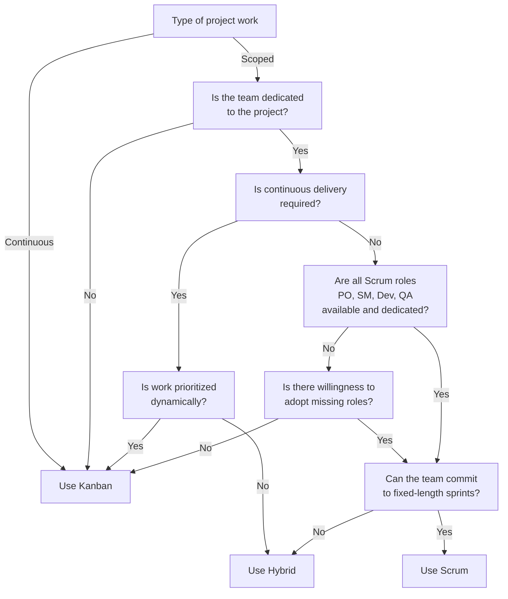

You are missing on features!

## Copilot PRs and more

## Advanced security & Dependabot

## GitHub is likely cheaper
The cost of using GitHub is likely lower than Azure DevOps. GitHub offers a free tier for public repositories and a very affordable Pro plan for private repositories. Azure DevOps has a free tier, but it is limited in terms of users and features. If you are using Azure DevOps, you are likely paying for the service, which can be more expensive than GitHub.

## The last hold out
Azure Boards is the last hold out for Azure DevOps. It is a great tool, but it is not enough to keep you on ADO. You can use GitHub Projects, which has been improved significantly in the last few years, and it is now a great alternative to Azure Boards.

If Azure Boards is the last thing you are holding out on and you are running Agile projects. The next question is whether you need the additional features of Azure Boards, such as advanced planning. Many projects are doing Scrum when a Kanban approach would be more suitable. Check whether you need full Scrum or if you can use a Kanban approach. If you are not sure, you can use the following decision chart to help you decide:

Cheers,\
Lucas