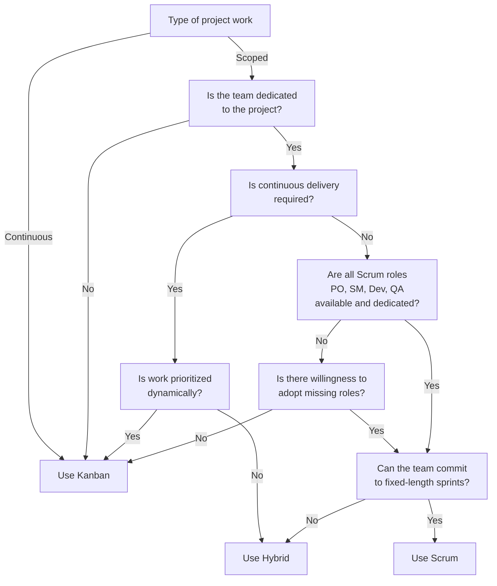

I've used Azure DevOps and its predecessors since 2007. It's been an incredible journey, evolving from the classic TFS (Team Foundation Server) with TFVC (Team Foundation Version Control) to today's Azure DevOps with Git. Features like Boards, Repos, and Pipelines have been part of my daily workflow for years, and it's been fantastic. But like everything in tech, it might be time to evolve. In this post, I'll explore why you should consider moving from Azure DevOps to GitHub.

Back in July 2023, I wrote [an opinionated guide to choosing between Azure DevOps and GitHub](/posts/2023-07-04-github-vs-azure-devops/). I compared both platforms and created a decision framework to help you pick the right tool. At the time, GitHub was better for most projects, but Azure DevOps still had advantages, particularly in agile project management and advanced planning with Azure Boards. While that's still somewhat true, the question isn't about what GitHub lacks anymore, but about what you're missing by not using it.

## Why you should make the switch

Simply put: you're missing out on innovation. While GitHub releases new features daily, Azure DevOps development has slowed significantly. Microsoft has poured massive investment into GitHub since acquiring it in 2018, and it's clear that GitHub represents the future of software development.

Don't take my word for it. Let's look at the features GitHub offers that Azure DevOps simply doesn't.

### 1. AI-powered development with Copilot

Like every tech company today, GitHub is heavily investing in AI, and they're doing it right. GitHub Copilot isn't just available in your IDE; it's deeply integrated throughout the platform. You get AI-powered code reviews, intelligent pull request summaries, and even coding agents that can help with complex tasks. While you can use GitHub Copilot in VS Code with Azure DevOps, you miss out on the platform-native AI features that make development truly seamless.

*GitHub Copilot providing intelligent code review suggestions directly in pull requests*

### 2. Built-in security and dependency management

GitHub's security features are impressive out of the box. [CodeQL](https://docs.github.com/en/code-security/secure-coding/using-code-scanning-with-github-codeql/about-code-scanning) provides automated code analysis to catch vulnerabilities, while [Dependabot](https://docs.github.com/en/code-security/supply-chain-security/keeping-your-dependencies-updated-automatically/about-dependency-updates) automatically monitors and updates your dependencies. Azure DevOps can achieve similar results through extensions, but GitHub's native integration is more powerful and user-friendly.

*GitHub's integrated security dashboard with Dependabot dependency alerts*

### 3. Native mobile experience

GitHub's mobile app lets you manage repositories, review issues, and handle pull requests from anywhere. While you wouldn't want to code on your phone, staying connected to your projects while away from your desk is invaluable. Azure DevOps has no official mobile app, and its web interface isn't optimized for mobile devices.

*GitHub's native mobile app*

### 4. Community collaboration with Discussions

GitHub Discussions creates a space for meaningful collaboration beyond code. It's perfect for asking questions, sharing ideas, and engaging with your community. Think of it as a friendlier, team-focused alternative to Stack Overflow that's built right into your project.

*GitHub's native discussions*

## What about Azure Boards?

Azure DevOps Boards remain some of the best tools for traditional Agile methodologies and advanced project planning. If you're running true Scrum, you won't find equivalent functionality elsewhere. However, ask yourself this crucial question: "Do you actually need Scrum?"

After years of experience, I believe many teams using Scrum probably shouldn't be. Here's a decision framework to help you determine the right approach for your team:

As the diagram shows, most projects and teams are better suited to a Kanban approach, particularly when they don't need strict Scrum ceremonies or dedicated roles. GitHub's [Projects](https://docs.github.com/en/issues/planning-and-tracking-with-projects/learning-about-projects/about-projects) feature offers a flexible Kanban-style board that adapts to your workflow without Scrum's overhead. You can also run full Scrum with GitHub Projects, though the reporting and planning features aren't as comprehensive as Azure Boards.

I've explored different approaches to running Scrum projects in GitHub in my post [Running Agile projects in GitHub Projects](/posts/2022-09-05-github-sprint-projects/). Last year, I revisited this topic in [Running Agile projects in GitHub Projects - 2024 review](/posts/2024-05-27-2024-review-github-sprint-projects/), which provides updated insights on managing agile projects in GitHub.

## What about Test Plans?

GitHub doesn't have a direct equivalent to Azure DevOps Test Plans and Test Suites. If you rely heavily on these features, you have two options: stick with Azure DevOps for now, or explore GitHub marketplace solutions like [TestQuality](https://github.com/marketplace/testquality?tab=readme).

For most modern projects, I strongly recommend investing in test automation using tools like [Playwright](https://playwright.dev/) or [Cypress](https://www.cypress.io/). This approach offers much more flexibility and speed than manual test plans. However, I understand this isn't always feasible, especially for legacy systems or projects requiring extensive manual testing.

## Ready to make the move?

If you're convinced that GitHub is the right choice for your team, you're probably wondering: "How do I actually migrate from Azure DevOps to GitHub?" The transition involves more than just moving your code repositories. You'll need to consider:

- **Repository migration** - Moving your Git repositories, including history and branches
- **Work item migration** - Transitioning issues, user stories, and tasks
- **Pipeline conversion** - Adapting your Azure Pipelines to GitHub Actions
- **Team onboarding** - Training your team on GitHub's workflow and features
- **Security and permissions** - Setting up proper access controls and security policies

The migration process can seem daunting, but with the right approach, it's more straightforward than you might think. In my next post, I'll walk you through a step-by-step guide to migrating from Azure DevOps to GitHub, including tools, best practices, and common pitfalls to avoid.

Stay tuned for the practical guide that will help you make this transition smoothly and efficiently.

Cheers,\
Lucas