[SpecKit](https://github.com/github/spec-kit) is an open-source toolkit from GitHub that transforms how we build software by putting specifications first. Unlike traditional development where we jump straight into coding, SpecKit guides you through a structured process: define what you want, clarify requirements, create a technical plan, break it into tasks, and finally implement. While it provides a CLI for setup, it's primarily a set of templates and agents that work within your existing AI coding assistant like GitHub Copilot.

SpecKit is a set of templates that help you navigate interactions with LLMs. While it provides a CLI, it is mostly for bootstrapping the structure needed instead of actively being used to create code from specs.

When you install SpecKit, you must select which AI framework you want to use. For instance, I've been using GitHub Copilot in VS Code and CLI. Depending on the AI and terminal selected, SpecKit CLI will download the appropriate template and install them locally. It typically will include a number of pre-defined agents, prompts, and scripts with necessary instructions for Copilot to work in the SpecKit style. Note that it doesn't work with SpecKit, but rather in its style. There is no additional tooling being used except the templates themselves.

Ultimately, you can easily fine-tune the SpecKit templates because they are simply `.md` files.

## How it works
In each step of the SpecKit flow, you MUST review the output and iterate with the AI on it. While you can manually modify the files created, it is preferred that you use prompts instead to make the modifications as needed. Additionally, SpecKit will guide you through the steps in the right order.

```mermaid
flowchart TD
    Start([New Project]) --> Init["specify init<br/>Initialize Project<br/><i>(Once Only)</i>"]
    
    Init --> InitOutput[".specify/ folder<br/>• agents/<br/>• memory/<br/>• scripts/"]
    
    InitOutput --> Constitution["/SpecKit.constitution<br/>Define Principles<br/><i>(Once Only)</i>"]
    
    Constitution --> ConstOutput["constitution.md<br/>• Code Quality Standards<br/>• Testing Requirements<br/>• UX Consistency<br/>• Performance Requirements<br/>• Privacy Rules"]
    
    ConstOutput --> FeatureStart([Feature Request])
    
    FeatureStart --> Specify["/SpecKit.specify<br/>Write Specification"]
    
    Specify --> SpecOutput["spec.md<br/>• User Stories<br/>• Requirements<br/>• Success Criteria<br/>• Edge Cases"]
    
    SpecOutput --> Clarify{Need<br/>Clarification?}
    
    Clarify -->|Yes| ClarifyMode["/SpecKit.clarify<br/>🔍 Resolve Ambiguities"]
    ClarifyMode --> ClarifyOutput["Updated spec.md<br/>• Clarifications § Session<br/>• Updated Requirements<br/>• Updated Assumptions"]
    ClarifyOutput --> Clarify
    
    Clarify -->|No| Plan["/SpecKit.plan<br/>Create Implementation Plan"]
    
    Plan --> PlanOutput["plan.md<br/>• Tech Stack<br/>• Constitution Check ✓<br/>• Project Structure<br/>• Phase 0/1/2 Workflow"]
    
    PlanOutput --> PlanArtifacts["Phase 0 & 1 Artifacts<br/>• research.md<br/>• data-model.md<br/>• contracts/*.json<br/>• quickstart.md"]
    
    PlanArtifacts --> Tasks["/SpecKit.tasks<br/>Generate Task List"]
    
    Tasks --> TaskOutput["tasks.md<br/>• concrete tasks<br/>• Organized by User Story<br/>• Dependencies marked<br/>• Parallel opportunities"]
    
    TaskOutput --> Analyze{Quality<br/>Check?}
    
    Analyze -->|Yes| AnalyzeMode["/SpecKit.analyze<br/>🔬 Find Inconsistencies"]
    AnalyzeMode --> AnalyzeOutput["Analysis Report<br/>• Coverage gaps<br/>• Ambiguities<br/>• Duplications<br/>• Constitution violations"]
    AnalyzeOutput --> AnalyzeDecision{Issues<br/>Found?}
    AnalyzeDecision -->|Yes| FixIssues["Fix Issues<br/>(Manual or Auto)"]
    FixIssues --> Analyze
    AnalyzeDecision -->|No| Analyze
    
    Analyze -->|No| Implement["/SpecKit.implement<br/>Execute Implementation"]
    
    Implement --> ImplPhases["Phase Execution:<br/>Setup<br/>Foundation<br/>User Stories<br/>Testing<br/>Polish"]
    
    ImplPhases --> ImplOutput["Implementation<br/>• Backend code<br/>• Frontend code<br/>• Unit tests<br/>• E2E tests<br/>• Documentation"]
    
    ImplOutput --> Complete([Feature Complete])
    
    Complete --> NextFeature{Another<br/>Feature?}
    NextFeature -->|Yes| FeatureStart
    NextFeature -->|No| End([Project Complete])
    
    %% Styling
    classDef onceOnlyClass fill:#E74C3C,stroke:#C0392B,stroke-width:4px,color:#fff
    classDef modeClass fill:#4A90E2,stroke:#2E5C8A,stroke-width:3px,color:#fff
    classDef artifactClass fill:#50C878,stroke:#2E7D4E,stroke-width:2px,color:#fff
    classDef decisionClass fill:#F39C12,stroke:#D68910,stroke-width:2px,color:#fff
    classDef outputClass fill:#9B59B6,stroke:#6C3483,stroke-width:2px,color:#fff
    
    class Init,Constitution onceOnlyClass
    class Specify,ClarifyMode,Plan,Tasks,AnalyzeMode,Implement modeClass
    class SpecOutput,ClarifyOutput,PlanOutput,PlanArtifacts,TaskOutput,AnalyzeOutput,ImplOutput,ImplPhases,InitOutput,ConstOutput artifactClass
    class Clarify,Analyze,AnalyzeDecision,NextFeature decisionClass
    class Start,FeatureStart,Complete,End outputClass

    %% Additional notes
    Note1["ONE-TIME SETUP:<br/>• specify init - Creates .specify/ structure<br/>• /SpecKit.constitution - Defines project principles"]
    
    Note2["REPEATABLE PER FEATURE:<br/>• Clarify: Until ambiguities resolved<br/>• Analyze: Can run multiple times<br/>• Implement: Iterative by phase"]
    
    style Note1 fill:#FADBD8,stroke:#E74C3C,stroke-width:2px,color:#2C3E50
    style Note2 fill:#ECF0F1,stroke:#BDC3C7,stroke-width:2px,color:#2C3E50
```



### 1. Initialize the project
You can either create a new project or continue a project you already have code for. Starting a project from scratch means you will have the specs from the beginning which should make the work with SpecKit and its agents more accurrate.

```bash
# for a new project
uvx --from git+https://github.com/github/spec-kit.git specify init <PROJECT_NAME> --ai copilot

# for an existing project
uvx --from git+https://github.com/github/spec-kit.git specify init --here --ai copilot
```

The result of the initialization is the expansion of the SpecKit template for the chosen AI and terminal. If using GitHub Copilot, the added files include:

- `.github/agents` folder with agent definitions
- `.github/prompts` folder with predefined prompts. The prompts are translated into the custom slash commands like `/SpecKit.constitution`, `/SpecKit.specify`, `/SpecKit.plan`
- `.specify/` folder with memory, scripts, and templates directories customized for your AI assistant and terminal


### 2. Create a constitution
This is a set of ground rules that apply to every feature you have. You should consider defining critical requirements like performance, testability and coverage here. You should create the constitution once, after that you can skip to creating specifications.

```prompt
/SpecKit.constitution Create principles focused on code quality, testing standards, user experience consistency, and performance requirements
```

The result is the `constitution.md` file being created with the details of your project's governing principles. This might include requirements like:

- **Code Quality**: All code must follow language-specific best practices and style guides
- **Testing**: Minimum 80% code coverage with unit and integration tests
- **Performance**: API responses under 200ms, page loads under 2 seconds
- **Privacy**: No PII stored without encryption, GDPR compliance required


### 3. Create a new specification
These are the actual features you want in your app. Things such as `create a web app skeleton for web analytics server` and `provide a dashboard to view page views by date as a chart` are example features. You should not provide technical requirements in features. That will be done in a later step.

```prompt
/SpecKit.specify build an event processing feature. When a user accesses a page that leverages sharp-web-insights, the page should have the ability to send events other than pageView for processing. The events are basically a name with some metadata attached to them. The metadata is dynamic and based on the event itself. Some events may not need additional metadata. The server will store the events using the property from the client, the timestamp, and the metadata. Events do not need to be registered up-front before pages can send them. Similar to pageViews, property check, rate limit, and other restrictions should be applied.
```

Each feature created will generate a new numbered folder with the feature short name in the specs folder. Inside, you will find a `spec.md` file containing:

- **User Stories**: Clear descriptions of what users need to accomplish
- **Requirements**: Functional and non-functional requirements
- **Success Criteria**: Measurable outcomes that define completion
- **Edge Cases**: Boundary conditions and error scenarios to handle


### 4. Clarify spec requirements
Validate the spec completeness and whether it adheres to the constitution. This step uses AI to spot problems in the spec such as `no tests will be created` when the constitution requires `80% test coverage for all features`. Each clarification is a question with a list of options already provided or you can iterate on it as well.

```prompt
/SpecKit.clarify
```


### 5. Build a Technical Plan for the Spec
This is where you provide technical details for the solution. The AI will validate your tech stack choices against the constitution and create a comprehensive implementation plan including architecture, data models, and API contracts.

```prompt
/SpecKit.plan Create a plan for the spec. I am building frontend with vite, tailwindcss, and chart.js. Keep frontend dependencies as minimal as possible. I am building the backend with Go and its http server.
```

The plan will be organized into phases (Phase 0: Research, Phase 1: Foundation, Phase 2: Implementation) with deliverables for each phase.


### 6. Create tasks for the plan
Break down the implementation plan into concrete, actionable tasks organized by user story with clear dependencies.

```prompt
/SpecKit.tasks Break the plan into tasks
```


### 7. Analyze the plan and tasks (Optional but Recommended)
Run a cross-artifact consistency analysis to find coverage gaps, ambiguities, duplications, or constitution violations before implementation begins.

```prompt
/SpecKit.analyze Run a project analysis for consistency
```

This step helps catch issues early, reducing costly rework during implementation.

### 8. Implement the spec
The AI will execute implementation based on the plan. This can take considerable time depending on feature complexity. The AI will work through tasks systematically and mark them as completed, but you may be prompted to approve commands or continue to the next step. Implementation follows the phases defined in your plan: Setup → Foundation → User Stories → Testing → Polish.

```prompt
/SpecKit.implement
```

## Real-World Insights
I built a real feature for a personal project to understand how SpecKit works in practice. After going through the complete workflow—from constitution to implementation—here are my observations. Overall, I enjoyed the experience and will continue using it for certain types of projects, though it's not a universal solution.

### Key Advantages
1. **Constitution-Driven Consistency**: The constitution defines base guidelines for your entire solution. All agents respect and validate specs against it, ensuring consistency across features.

2. **Living Documentation**: Specifications are saved alongside your code in extreme detail, creating valuable documentation that stays in sync with implementation.

3. **Guided Workflow**: SpecKit provides a structured process that reduces decision fatigue and helps you focus on what matters—building the right thing.

4. **Highly Customizable**: Since SpecKit is just templates (`.md` files), you can customize it extensively to fit your team's needs while benefiting from the solid defaults.

### Critical Considerations
1. **High Cognitive Load**: Specs are extremely detailed, which increases review burden. You may need AI assistance just to navigate your own specifications.

2. **Significant Iteration Required**: Despite detailed specs, implementation still requires substantial back-and-forth with AI. Coding complexity doesn't disappear—it shifts to the spec phase.

3. **Mindset Shift Required**: SpecKit feels similar to Test-Driven Development (TDD) or Behavior-Driven Development (BDD)—it's more about how you think than what you produce. It works best when adopted from project start with team buy-in.

4. **Increased AI Costs**: Expect higher token usage due to multiple workflow phases. Budget accordingly, especially for larger features.

5. **Brownfield Challenges**: Integrating SpecKit into existing large codebases is difficult. It shines brightest on greenfield projects.

## Additional Resources
- [The ONLY guide you'll need for GitHub Spec Kit](https://www.youtube.com/watch?v=a9eR1xsfvHg&t=1s)
- [Using GitHub Spec Kit with your EXISTING PROJECTS](Using GitHub Spec Kit with your EXISTING PROJECTS)
- [GitHub Spec Kit DOES WHAT Under The Hood?](https://www.youtube.com/watch?v=o6SYjY1Bkzo&t=1270s)


## Conclusion
SpecKit represents a significant evolution in AI-assisted development—it's not just about generating code faster, but about thinking through problems more systematically. By forcing you to define specifications, validate requirements, and create detailed plans before implementation, SpecKit can lead to higher-quality, better-documented software.

**When to use SpecKit:**
- Starting a new project from scratch (greenfield development)
- Building features that require careful planning and documentation
- Working with teams that value structured processes
- Projects where specifications are as important as code like in regulated industries

**When to skip it:**
- Quick prototypes or experiments where speed matters more than structure
- Existing large codebases without established specs
- Small bug fixes or minor enhancements
- Teams unfamiliar with spec-driven or test-driven approaches

If you're curious about spec-driven development, I recommend trying SpecKit on a small project. The [official repository](https://github.com/github/spec-kit) has excellent documentation, and the community is active and helpful. Just remember: SpecKit is a tool, not a silver bullet. Like any methodology, its value depends on how well it fits your context.

*Have you tried SpecKit or spec-driven development? I'd love to hear about your experiences in the comments below.*

Cheers,\
Lucas