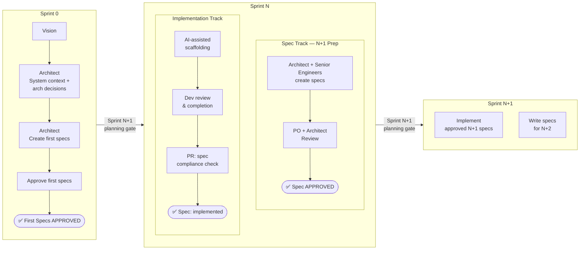
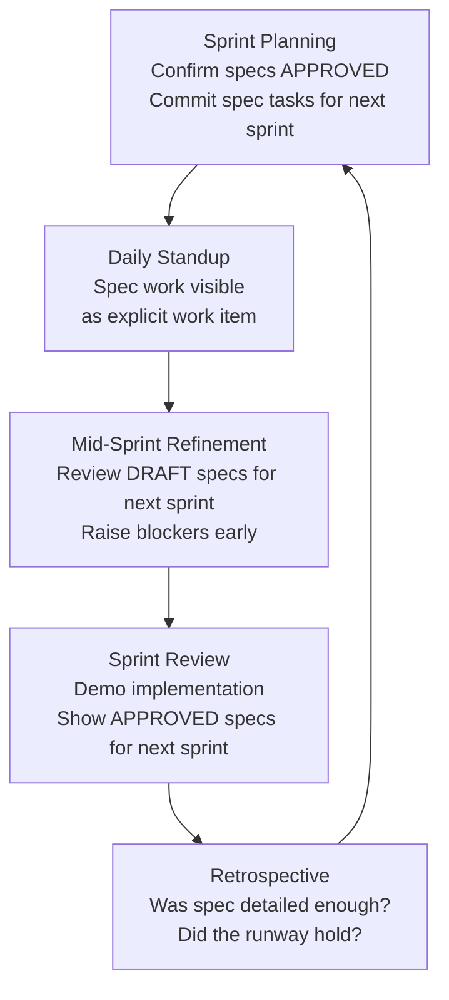

If your team is already running Agile and experimenting with AI-assisted development, you've probably felt the tension: AI tools are most effective when given the right context, but most backlogs are written in just enough detail for a human to interpret — not enough to drive generation. Spec-Driven Development addresses that gap. This post focuses on the *how* of integrating it into your existing process.

## Value of Agile

Agile remains the dominant approach for software development in enterprise environments. Its core strength is the feedback loop — short iterations surface problems early, allow course corrections, and keep stakeholders aligned without requiring perfect upfront planning. Whether your team practices Scrum with defined sprints and its ceremonies or a lighter Kanban flow, the underlying principle is the same: deliver incrementally, inspect frequently, and adapt as you learn.

That adaptability is worth protecting. Any process change — including adopting spec-driven development — needs to work *with* the Agile cadence, not against it.

## Value of Spec-Driven Development

Spec-Driven Development shifts the team's focus from informally describing what to build to formally specifying it before implementation begins. A spec is a structured, reviewable document that defines the functional and technical requirements, system context, constraints, and acceptance criteria for a given unit of work.

The practical benefits are significant:

- **Reduced ambiguity and rework.** When requirements are explicit and reviewed before coding starts, the costly cycle of build-feedback-rebuild shortens considerably.
- **AI-assisted implementation becomes reliable.** AI coding tools are only as good as the context they're given. A well-structured spec gives AI tools the precise input needed to generate scaffolding, tests, and implementation that is actually aligned to intent.
- **Living documentation.** Specs committed to the repository alongside code create a traceable record of *why* decisions were made — something that survives team turnover and sprint retrospectives alike.
- **Earlier architectural review.** Specs surface design decisions before code is written, when changing direction is cheaper.

## Better Together: Agile and Spec-Driven Development

Agile and spec-driven development solve different problems and complement each other naturally. Agile provides the cadence, the feedback loops, and the structure for adapting to change. Spec-driven development provides the precision *within* each iteration — a clear contract between what was requested and what gets built.

Without specs, Agile teams often rely on implicit understanding and tribal knowledge to bridge the gap between a backlog item and working code. That works reasonably well with stable, experienced teams but breaks down as teams grow, turn over, or start leaning on AI to accelerate delivery.

Without Agile, Spec-Driven Development risks becoming waterfall with extra steps — heavy upfront documentation that grows stale before implementation catches up. The Agile cadence keeps specs lean, relevant, and anchored to actual delivery.

Together, you get the adaptability of Agile with the intentionality of spec-driven work. AI assistance becomes a predictable accelerator rather than an unpredictable wildcard.

## The Process

This process works best when starting a new project, but teams can enter at step 3 if a project already has an established backlog and architecture.

### 1. Define Product Scope and Vision

Before any specs are written, capture the product vision in a lightweight document — not quite a spec, but close enough in format that every spec written later can trace back to it. This prevents individual specs from drifting in different directions over time. Think of it as the north star that architectural and functional decisions get validated against. GitHub Spec Kit is a framework for managing specs as first-class artifacts in your repository. If you are using it, the product scope and vision document acts as its constitution — the root document that grounds all subsequent specs.

Example prompt:

```prompt
I'm planning to create an app to track food habits and how they impact a user's quality of life. Can you help me create a product scope and vision document in /specs directory? I'm planning to use this document as grounding information for all specs to follow. Please ask me any questions to help you achieve this.
```

You can see the generated result at this example app: [Sharp Bite](https://github.com/jlucaspains/sharp-bite/blob/main/specs/product-scope-and-vision.md)

### 2. Derive a Feature Backlog

Break the vision into deliverable epics and features. These items become the top level of your work item hierarchy in Azure DevOps or GitHub Projects. At this stage, precision isn't the goal — the backlog is a roadmap that will be refined as the project progresses. Each feature will later be decomposed into Product Backlog Items (Stories) or Issues during iteration.


### 3. Define Initial Architecture and Project Scaffolding

Before iterative delivery begins, establish the architectural foundation. This includes:

- **Spec system setup** — define where specs live (`specs/` in the repo), the front matter schema, the status workflow, and any AI framework setup.
- **Initial system context specs** — document constraints, integration boundaries, and key architectural decisions as specs so they are version-controlled and reviewable
- **Project scaffolding spec** — a spec for the initial project structure, dependency choices, and validation processes

Example spec:

[sharp-bite project setup spec](https://github.com/jlucaspains/sharp-bite/blob/main/specs/project-setup.md)

### 4. Iteration

Each iteration runs two workstreams in parallel: spec creation for the *next* iteration and implementation of the *current* iteration's approved specs. See the Spec Runway section below for detail on how these tracks interact.

**[PO + Architect] Expand features into actionable work items**
- Decompose each feature into delivery-sized backlog items
- Each work item gets a description and acceptance criteria written from a business value perspective
- Work items without an associated spec are not yet eligible for sprint planning


**[Engineers + Architect] Create and approve specs for each story**
- Specs are authored collaboratively — see the Distributing Spec Ownership section below
- Each spec file lives in `specs/` in the repository and uses YAML front matter to link back to its work item and track its status:

```yaml
---
title: "User Authentication"
work-item-url: https://dev.azure.com/org/project/_workitems/edit/1234
# or for GitHub Issues:
# work-item-url: https://github.com/org/repo/issues/42
status: draft | approved | implemented
authors: [lead-architect, dev-name]
---
```

**Right-sizing specs:** A spec should be detailed enough that a developer unfamiliar with the work item could begin implementation without asking clarifying questions — but no longer than needed to achieve that. As a rule of thumb: if a spec exceeds roughly two pages, consider whether the story should be split. A well-sized spec typically covers functional requirements, technical approach, edge cases, error handling, and acceptance criteria.

**Ensure Spec Traceability**
- There are 2 primary ways to track specs for work items
   - Create a work item for the requirement and another for the spec. This will ensure velocity for spec writing is tracked on the right sprint but it will look unconventional with 2 very similar work items. A reference from the spec to requirement work items will help track related work.
   - Create a single work item for both requirement and spec. Create a task for the spec. It will look cleaner, but the work item effort needs to account for both spec and implementation. The work item will always be part of 2 sprints (spec sprint and implementation sprint).
- A GitHub Actions workflow validates specs on pull requests: it checks that the referenced work item exists, posts a link back to the work item, and blocks merges when spec status is still `draft`
   - [Example GH Actions workflow](https://github.com/jlucaspains/sharp-bite/blob/main/.github/workflows/validate-specs.yml)
- PR and commit messages carry the work item reference natively: `AB#1234` for Azure DevOps, `Closes #42` or `Refs #42` for GitHub Issues
   - [Example PR](https://github.com/jlucaspains/sharp-bite/pull/67) — creating full traceability from spec to work item to PR to commit

## Distributing Spec Ownership

A natural instinct when adopting spec-driven development is to put the architect in charge of writing all specs. This creates a bottleneck immediately. The architect becomes a single point of failure, spec creation becomes the slowest step in the process, and the team doesn't develop the skill of writing good specs themselves.

The better model is to treat the architect as the **owner of spec quality**, not spec authorship. Distribute writing responsibility to other Engineers to allow for scaling.

| Spec | Author |
|---|---|
| System context, constraints, architectural decisions | Architect |
| Requirements, Edge cases, happy path flows, error handling, technical plan | Engineers |
| Acceptance criteria alignment | Product Owner |
| Final approval | Architect & Product Owner |

AI tooling accelerates this ramp-up. A developer can prompt an AI with a story description and get a reasonable spec draft to react to — lowering the cognitive barrier of starting from a blank document. Spec templates reduce it further.

## The Spec Runway

Trying to write a spec, get it approved, and implement it all within the same iteration is a recipe for shortcuts. Either the spec gets rushed to meet planning, or implementation gets squeezed because spec review ran long. The solution is a **spec runway**: a two-track model where spec work runs one sprint ahead of implementation.

```
           Sprint N-1             Sprint N              Sprint N+1
           ─────────────────────────────────────────────────────────
Spec Track  [Write & Approve       [Write & Approve      [Write & Approve
            specs for Sprint N]    specs for N+1]        specs for N+2]

Impl Track                         [Implement            [Implement
                                   Sprint N specs]       Sprint N+1 specs]
```

Every sprint has two concurrent workstreams:
- **Spec track:** Author and approve specs for the *next* sprint's work items
- **Implementation track:** Build against the *current* sprint's already-approved specs

Sprint planning is never blocked because approved specs are always ready — they were written last sprint. The spec approval gate at sprint planning becomes a quality check, not a last-minute scramble.

**Capacity must explicitly account for spec work.** It doesn't happen for free:

| Workstream | Approximate Capacity |
|---|---|
| Implementation | ~60% |
| Spec writing (next sprint prep) | ~25% |
| Spec review and iteration | ~15% |

These percentages reflect early adoption. As the team builds templates and familiarity, the spec+review overhead tends to drop to ~10–15% of total capacity, with implementation recovering accordingly.

**For existing projects**, a full spec runway from day one isn't realistic. Use a gradual onramp: start spec-driven on new features only. Existing in-flight Stories continue under the current process. Specs catch up to the backlog over time rather than blocking delivery now.


## Adapting for Kanban

The spec runway model described above is sprint-centric. Kanban teams can achieve the same outcomes through a pull-based queue model that mirrors the underlying intent.

### Board Column Structure

```
Spec Backlog → Spec In Progress → Spec Approved → Development → Done
```

The key policy: **a work item cannot enter the Development column until its spec reaches `Approved` status** — the direct equivalent of the sprint planning gate.

### WIP Limits and the Spec Buffer

WIP limits on spec columns replace sprint capacity allocation. Limiting spec work in progress to 2–3 items at a time prevents spec work from ballooning and blocking the Development column. The "spec runway" becomes a **lead time buffer**: target 2–5 items in the `Spec Approved` column at all times to ensure the Development column never starves for ready work.

### Metrics

Replace velocity-based metrics with flow metrics:

| Metric | Definition |
|---|---|
| Spec cycle time | Time from `Spec In Progress` to `Spec Approved` |
| Spec throughput | Specs approved per week |
| Development cycle time | Time from `Development` to `Done` |

### Ceremonies

Kanban uses a different ceremony vocabulary, but the underlying objectives map directly:

| Kanban Ceremony | Scrum Equivalent | Notes |
|---|---|---|
| Replenishment meeting | Backlog refinement + spec refinement | Pull new items into `Spec Backlog`; review `draft` specs for promotion |
| Service delivery review | Sprint review | Review completed work and specs approved since the last review |
| Retrospective | Retrospective | Same questions apply — replace velocity with throughput and cycle time |

The Definition of Ready and Definition of Done criteria from the Scrum section apply equally in Kanban — applied at item pull time rather than sprint planning. The retrospective questions from the Scrum section apply as well; where those questions reference velocity, substitute throughput and cycle time.

## Updating Your Ceremonies

The following ceremony guidance is written in Scrum terms. Kanban teams should refer to the [Adapting for Kanban](#adapting-for-kanban) section for the equivalent mapping. The changes are additive — nothing gets removed, but new gates and artifacts become part of the rhythm.

### Definition of Ready (updated)

A story is only ready for sprint planning if all of the following are true:

| Criterion | Owner |
|---|---|
| Spec exists in the repo with `approved` status | Architect |
| Acceptance criteria on the story match the spec | Product Owner |
| Work item URL is referenced in the spec front matter | Anyone |
| No unresolved comments or open questions on the spec | Architect + PO |

### Definition of Done (updated)

| Criterion | New? |
|---|---|
| Code reviewed and merged | Existing |
| Tests pass | Existing |
| Acceptance criteria verified | Existing |
| Spec status updated to `implemented` | ✅ New |
| Spec reflects any approved deviations from implementation | ✅ New |
| Work item linked to PR/commit | Existing (formalized) |

### Backlog Refinement

Refinement splits into two tiers:

**1 - Story Refinement**
Ensure the story has enough information to create a spec from including the acceptance criteria. The PO validates that acceptance criteria align with business intent.

**2 - Spec Refinement**
Review `draft` specs for next sprint. Blockers surfaced here (ambiguous requirements, missing architectural decisions) have time to be resolved before sprint planning.

### Sprint Planning
Only work items with `approved` specs are pulled into the sprint. Spec-writing tasks for next sprint's work items are committed to as explicit capacity — not background work.

### Daily Standup
Spec work is a visible work item on the board, not invisible preparation. "Writing spec for Story-1234" is a legitimate standup status.

### Sprint Review
The review covers two outputs: working software implemented this sprint, and approved specs ready for next sprint. Both are deliverables.

### Retrospective
Add these questions to the regular retro:
- Was the spec detailed enough to start implementation without needing clarification?
- Did AI tooling save time, and where did it fall short?
- Were any deviations from spec caught early or late?
- Is spec-writing effort correctly reflected in our velocity?

For teams past sprint 10, add these supplementary questions:
- Are we carrying spec debt from last quarter? What contributed to it?
- Do our system context specs still accurately reflect the actual system?
- Which implemented specs are now misleading or out of date?
- Have new team members been able to use the spec library effectively?
- Is our spec archive growing appropriately? Are we retiring specs as features are deprecated?

## Avoiding Common Pitfalls

**Specs as shelfware.** The most common failure mode is specs that are written to clear the Definition of Ready gate but never actually referenced during implementation. AI output gets used as-is without being validated against the spec. Deviations go undocumented. The spec and the codebase drift apart. The fix: make spec review an explicit part of code review ("does this match the spec?"), require spec status to be updated to `implemented` as part of Done, and treat spec updates for approved deviations as non-optional.

**Architect as the bottleneck.** If the architect is the sole spec author, the spec runway stalls every time they're pulled into other work. Distribute authorship as described above. The architect's review time is a fixed constraint — spec *writing* time should scale with the team.

**Estimating without accounting for spec work.** Estimate spec and implementation efforts separately. Given the efforts are done in different sprints, it will make for better velocity tracking.

**Trying to spec everything immediately.** On active projects, requiring specs for all existing work items before any sprint can proceed will paralyze delivery. Start with new work. Let specs fill in over time.

**Applying the runway to all work types.** The spec runway is designed for feature work items. Bug fixes, security patches, and spikes operate on different timescales. Emergency bug fixes are exempt from the spec runway requirement — speed is the priority — but benefit from a lightweight post-implementation spec written within the same sprint. Spikes and investigations should have a spec capturing the question being asked and the outcome or decision reached.

## Sustaining Spec Quality on Long-Running Projects

Most of this post describes how to start. Projects running 30+ sprints face a different challenge: sustaining spec quality as the codebase and team evolve.

### Spec Drift

Specs drift not from negligence but from accumulated small decisions — a constraint relaxed, an edge case added, a third-party API that changed behavior. The spec and the code each remain correct but no longer describe the same thing.

Detection strategies:
- Include "spec review" as a checklist item in your PR template: "Does the code still match the spec?"
- Schedule a quarterly spec health review where the team walks through all `implemented` specs in a recently changed area and flags any that are out of date.

### Spec Debt

Just like technical debt, spec debt grows under pressure. When deviations go unrecorded or refactors render older specs partially obsolete, the spec library becomes misleading. Treat spec debt as a first-class backlog concern: track it explicitly, review it in retrospectives, and reserve a portion of capacity each sprint to address it.

### Team Turnover

The text of a spec survives turnover; the *context* often doesn't. A constraint like "must complete in <200ms" without a recorded rationale becomes a puzzle two years later. Annotate specs with *why*, not just *what*. New team members should do a spec review rotation as part of onboarding — reading existing `approved` and `implemented` specs is the fastest way to understand the system's intent.

### Archiving and Retiring Specs

Long-running projects accumulate hundreds of `implemented` specs. Some will describe features that were later deprecated or fundamentally redesigned. Define a lifecycle:

1. Specs for active features remain in `specs/` with `implemented` status.
2. Specs for deprecated features move to `specs/archive/` with an `archived` status and a note on *why* the feature was retired.
3. Specs invalidated by a major refactor should be updated to reflect the new design before the refactor PR is merged.

### Runway Evolution

As a project matures past the high-growth phase, the ratio of new feature work to maintenance, bugs, and refactors shifts. The spec runway doesn't disappear, but it adapts: the spec track shrinks as fewer new work items enter each sprint, and architectural decision records (ADRs) become more prominent than feature specs. At this stage, the architect's focus shifts from spec authorship and review toward maintaining the system context specs and ADR library.

## Conclusion

Spec-Driven Development isn't a replacement for Agile — it's a precision layer that makes Agile more effective at scale. The process described here is practical and adoptable today, whether your team runs Scrum sprints or a continuous Kanban flow, and whether you're on day one or sprint thirty-five. That said, treat it as a living framework rather than a finished prescription. AI-assisted development is evolving rapidly — new capabilities in code generation, spec authoring, compliance verification, and context retrieval are surfacing continuously — and as they do, the tooling, the automation hooks, and the capacity assumptions in this process will evolve with them. The fundamentals — clear specifications, shared ownership, traceable decisions, and sustainable cadence — will hold. How AI accelerates each of those fundamentals is still being written.

## Diagram: The Spec Runway



## Diagram: Ceremony Touchpoints



---

Cheers,\
Lucas